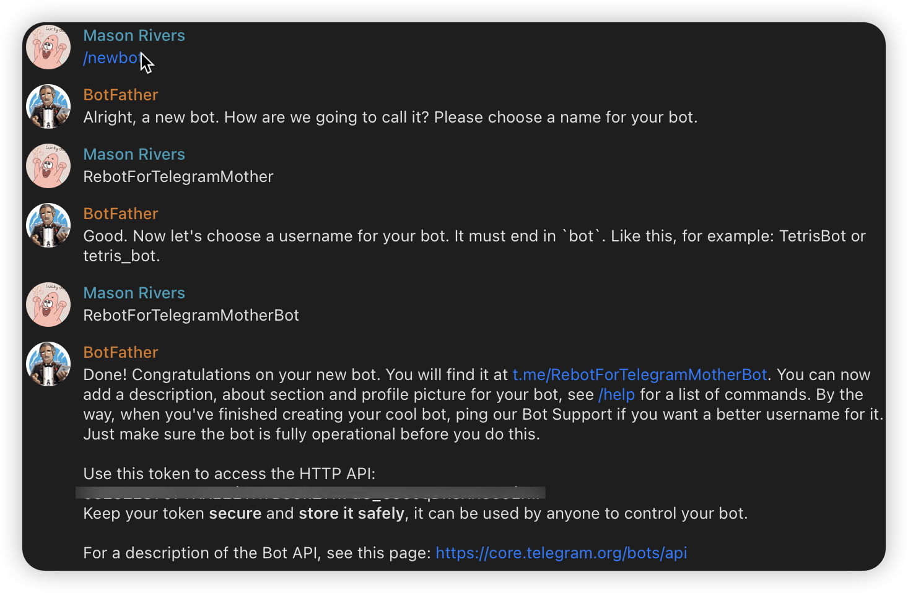
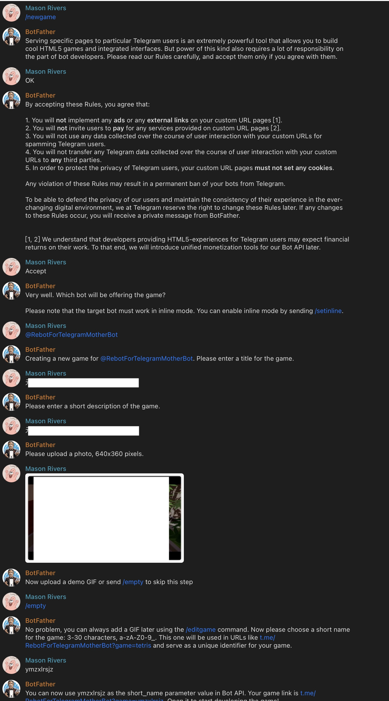
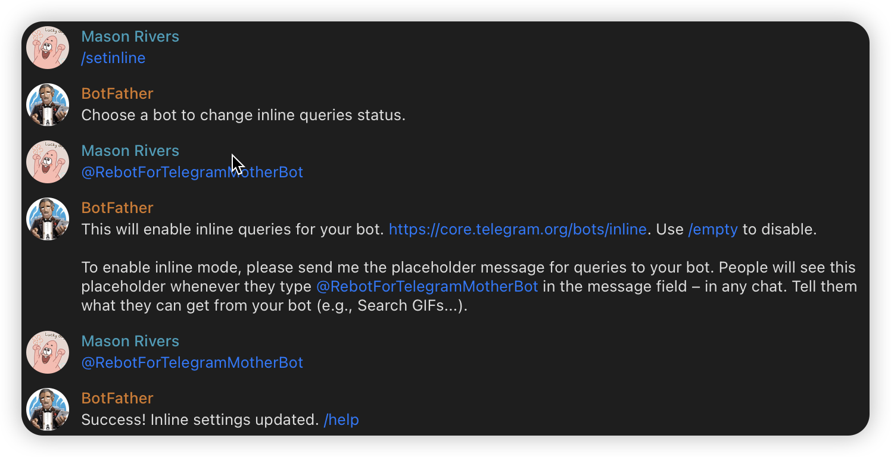
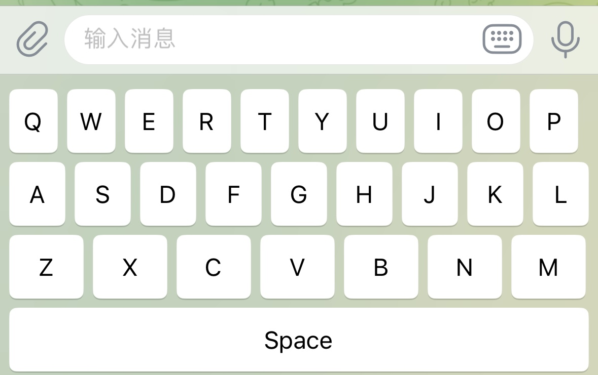
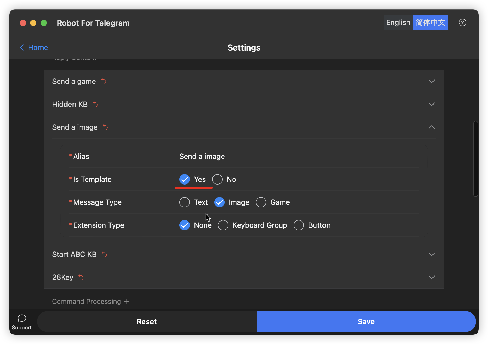
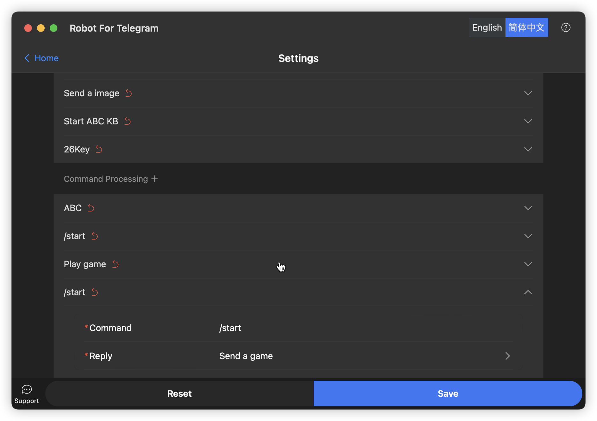
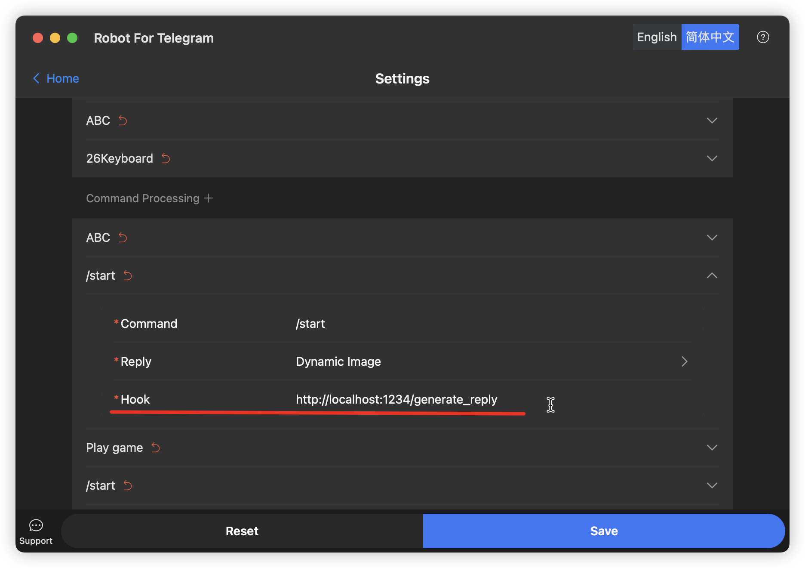

# RobotForTelegram

English | [简体中文](./README.zh-CN.md)

Robot For Telegram is a desktop product designed to help users manage multiple Telegram bots and provide a range of
management and interaction features.

## Features:

- [x] Users can add multiple Telegram bots and manage their keyboard settings.
- [x] It allows receiving commands and replying to messages, supporting text, images, games, and inline buttons.
- [x] Users can customize reply content through a Hook URL before replying to messages.
- [x] Users can choose to integrate OpenAI ChatGPT for more intelligent chat interactions.

## FAQ:

    This FAQ provides answers to basic questions about this product.

### FAQ about telegram:

#### How to create a bot?

    Contact the @BotFather bot on Telegram and follow the instructions to create a bot.

#### How to create a game?

    Contact the @BotFather bot on Telegram and follow the instructions to create a game.

#### How to enable inline queries?

    Contact the @BotFather bot on Telegram and follow the instructions to enable inline queries.

### FAQ about RobotForTelegram:

#### How to use keyboard groups?

    The effect seen on the mobile phone is like this.

#### How to use reply?

    If your reply is dynamic content, check the template option.

#### How to listen commands?

    If the reply you selected is dynamic. You must set Hook URL. When the command is triggered, i will call your api and get the reply.

### FAQ about OpenAI:

#### How to get an api-key?

    Navigate to your API key management page. And click on "Create new secret key".

#### Max Token

    The maximum number of tokens to generate. Requests can use up to 4096 tokens for content generation, and 2048 tokens for classification.

#### Temperature

    What is the temperature of the sampling. Higher temperature results in more random completions. Lower temperature results in more conservative completions.

#### Top P

    An alternative to sampling with temperature, called nucleus sampling, where the model considers the results of the tokens with top_p probability mass.

#### Frequency Penalty

    The frequency of the request. The higher the frequency, the more the request will be used.

#### Presence Penalty

    Presence penalty is a method of controlling the likelihood that certain words or phrases will appear in the output generated by GPT-3. It assigns a value to certain words or phrases and increases or decreases their likelihood of appearing in the output depending on whether the value is positive or negative.

#### History Length

    The number of historical messages carried when requesting OpenAI. The greater the number, the more tokens are used, and it is easier to reach the token limit.

#### System Prompt

    The system prompt is a piece of text that is used to provide context to the model. It is used to help the model understand the context of the conversation and to provide more accurate and relevant responses.

#### Timeout

    Timeout when requesting OpenAI, in seconds.

## Build

- Confirm that you have installed [wails](https://wails.io/docs/gettingstarted/installation)
- Run `wails doctor` to check the environment. If there is no problem, you can continue to build.
- change directory to `app`
- Run `wails dev` to start the development environment. Or run `wails build` to build the executable file.
