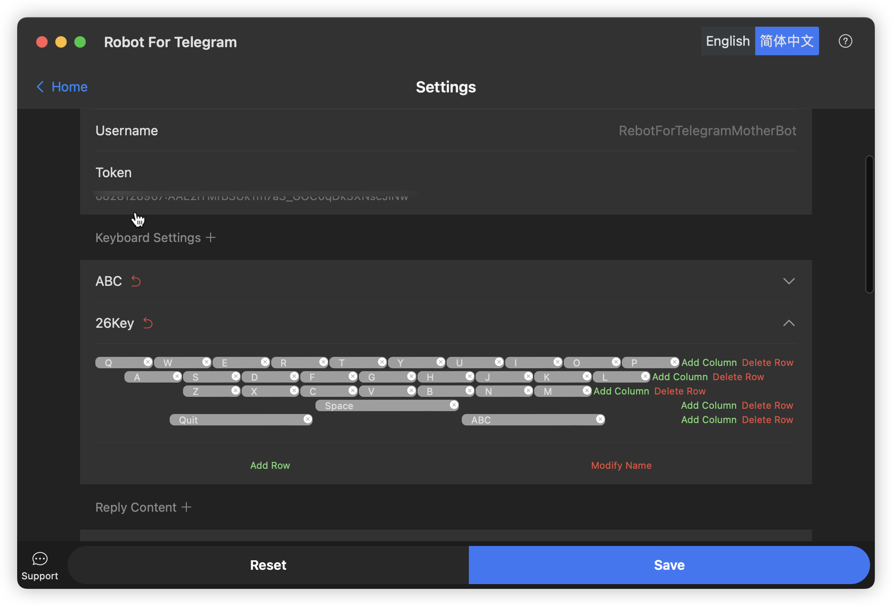

# RobotForTelegram

[English](./README.md) | 简体中文

Robot For Telegram 是一款桌面端产品，旨在帮助用户管理多个 Telegram 机器人，并提供一系列管理和交互功能。

## 功能说明:

- [x] 用户可以添加多个 Telegram 机器人，并管理其键盘设置。
- [x] 可以接收指令并回复消息，支持文本、图片、游戏等消息类型，同时支持内联按钮。
- [x] 在回复消息之前，用户可以通过 Hook 地址自定义回复内容。
- [x] 用户可以选择接入 OpenAI ChatGPT 进行更智能的聊天交互。

## FAQ:

    此常见问题解答提供了有关该产品的基本问题的答案。

### telegram相关:

#### 怎么创建机器人?

    联系 @BotFather 机器人，并按照提示创建机器人。

#### 怎么创建游戏?

    联系 @BotFather 机器人，并按照提示创建游戏。

#### 怎么启用内联查询?

    联系 @BotFather 机器人，并按照提示启用内联查询。

### 关于Robot For Telegram:

#### 如何使用键盘组?

    在手机上看到的效果是这样的。

#### 怎么使用回复?

    如果您的回复是动态内容，请勾选模板选项。

#### 怎么监听命令?

    如果您选择的回复是动态的。您必须设置 Hook URL。当命令被触发时，我将调用您的api并获取回复。

### 关于OpenAI:

#### 如何获取api-key?

    导航到您的 API 密钥管理页面。 然后单击“创建新的密钥”。

#### 最大Token数

    要生成的最大令牌数。 请求最多可以使用 4096 个令牌进行内容生成，使用 2048 个令牌进行分类。

#### 随机性

    较高的温度会导致随机性增加，较低的温度导致更保守的回复。

#### 核采样

    与温度采样相比的另一种选择，称为核采样，其中模型考虑具有 top_p 概率质量的令牌的结果。

#### 频繁惩罚

    频繁惩罚是用于控制模型生成常见或重复单词和短语的可能性的特征。它是一个可以调节的值，以使模型更有可能或更少地重复，具体取决于您的应用。

#### 重复惩罚

    重复惩罚是一种控制某些单词或短语出现在GPT-3生成的输出中的可能性的方法。它为某些单词或短语赋值，并根据该值是正还是负来增加或减少它们出现在输出中的可能性。

#### 上文数量

    请求OpenAI时携带的历史消息数量，数量越多，使用的token数量越多，更容易到达token上限。

#### 系统提示

    系统提示是一个可选的字符串，用于在对话开始时向用户介绍您的 AI。如果您不提供系统提示，OpenAI 将使用默认提示。

#### 超时时间

    请求OpenAI时的超时时间，单位为秒。

## 编译

- 确认你安装了 [wails](https://wails.io/docs/gettingstarted/installation)
- 运行命令 `wails doctor` 检查你的环境。如果没问题，你才可以构建。
- 把你工作目录切换刀 `app`
- 运行 `wails dev` 进行开发. 或者运行 `wails build` 来打包。
